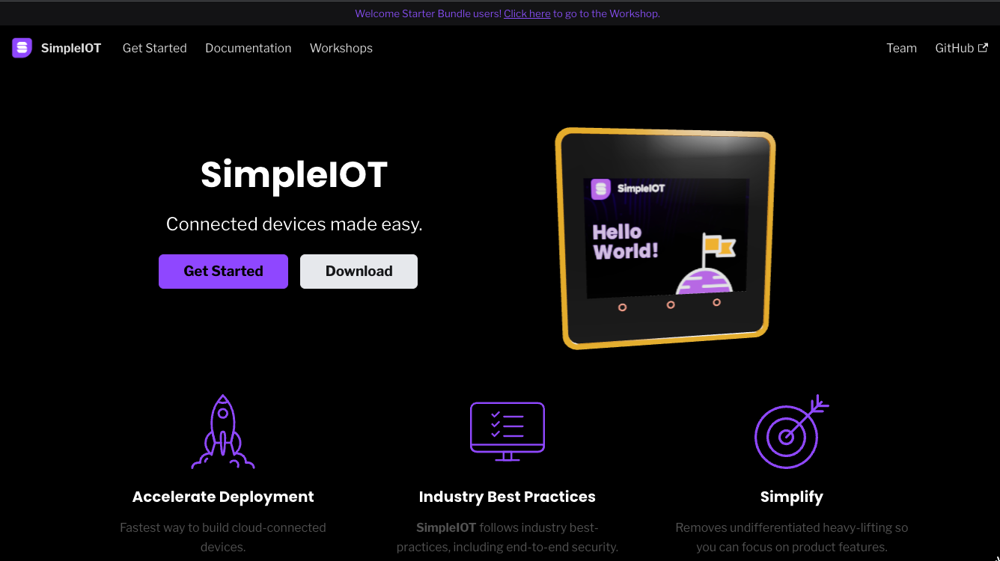

## simpleiot-build

This repository contains the sources and tools needed to push out the website and training materials for [SimpleIOT](https://github.com/awslabs/simpleiot).



The live site can be [seen here](https://awslabs.github.io/simpleiot-build/).

This repo includes sources to:

- Web-site, built using [Docusaurus](https://docusaurus.io/)
- Documentation sources
- Training materials (including workshops, etc.)

The output will be auto-deployed to Github pages and can be accessed via [https://simpleiot.net/](https://simpleiot.net/).

These are the current documentation channels:

| Name               | Framework                            | Purpose                              | Directory                                      |
|:-------------------|:-------------------------------------|:-------------------------------------|:-----------------------------------------------|
| Home               | [Docusaurus](https://docusaurus.io/) | Landing page                         | `website`                                      |
| CLI Docs           | (Embedded in Docusaurus)             | Command-line documentation           | `website/simpleiot/docs/documentation/cli`     |
| API Docs           | (Embedded in Docusaurus)             | REST API documentation (coming soon) | `docsrc/simpleiot/docs/documentation/api`      |
| Arduino Client SDK | (Embedded in Docusaurus)             | C++ SDK for the Arduino platform     | `docsrc/simpleiot/docs/documentation/sdk`      |
| Starter Workshop   | (Embedded in Docusaurus)             | HelloWorld and SensorDemo workshop   | `website/simpleiot/docs/workshops/starter`     |

### Documentation Sources

The documentation sources are in Markdown format, under the `website/simpleiot/docs` directory. Docusaurus renders them into static HTML during the build process. The material pushed out is generated HTML/CSS/JS under the `gh-pages` branch.


### Media files

The `media` directory contains material not directly related to the website. This includes source material such as 3D models, presentation files, illustration sources, and SVG files for the Starter Kit.

Thw `website/simpleiot/rawmedia` directory contains source material for images used throughout the website, documentation, and workshops. The outputs are scaled and sized and stored in the `website/static/img` directory.

### Build Process

```
cd website/simpleiot
npm install
npm run serve
```

The website will be built locally and can be browsed at http://localhost:3000/.


### Deploying to Github pages

Once changes are made, they can be pushed out to the `main` branch.

The Github action workflow file is under: `simpleiot-build/.github/workflows/deploy-website.yml`. Any push to the `main` branch will automatically invoke the build process to automatically update the website on the `gh-pages` branch.

## Security

See [CONTRIBUTING](CONTRIBUTING.md#security-issue-notifications) for more information.

## License

This project is licensed under the Apache-2.0 License.
